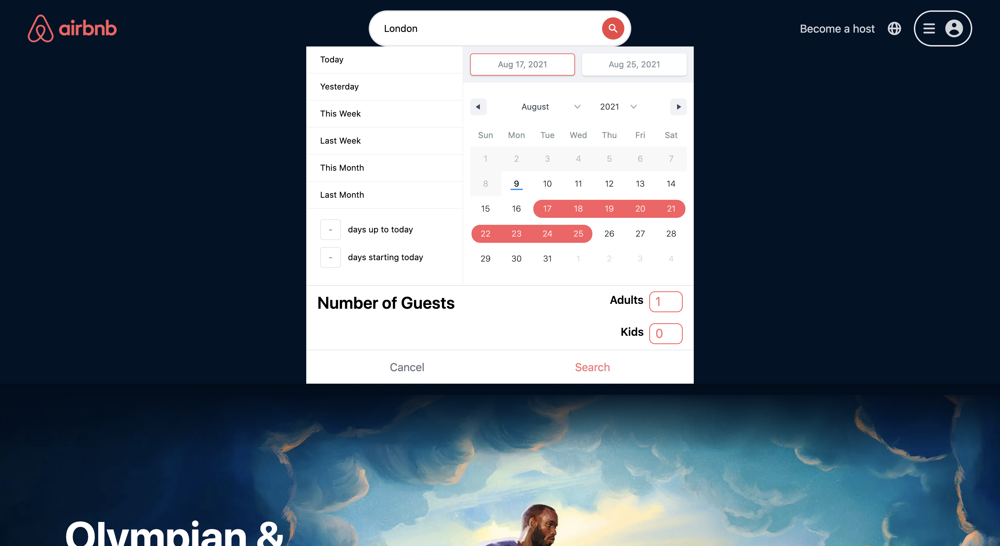
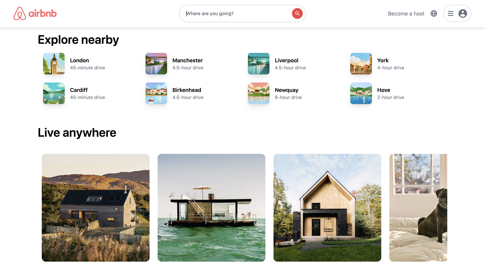
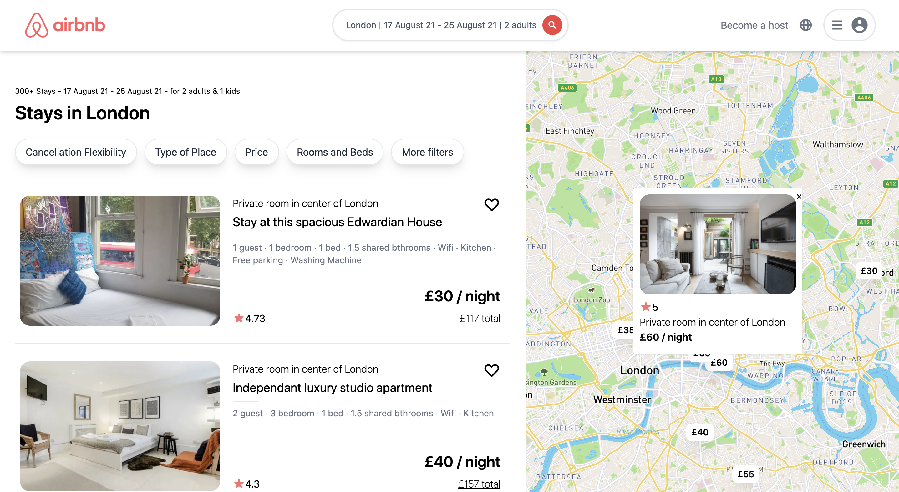
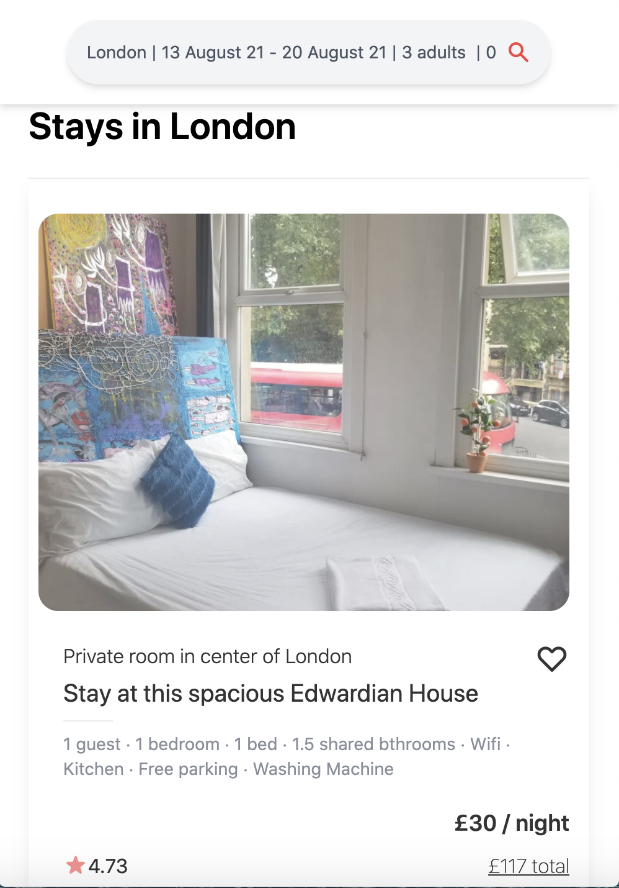

# Airbnb-Clone

Created with Next.js, ReactJS, Tailwind CSS, Mapbox, REST API, HTML, CSS.

# Functionality

Type a city name on search bar, select the booking dates on calender, provide no of guests and search. The search will show a dummy data for now with it's actual map positions as well.

<a href="https://airbnb-clone-jc8a6wm50-danish061296.vercel.app/"><strong>LIVE DEMO</strong></a>

# App Screenshots

## Desktop Version

 
 

 

 
 

 

 
 

 

 
 

 

## Mobile Version

               

## Inspired by:

Sonny Sangha (PAPA REACT)
